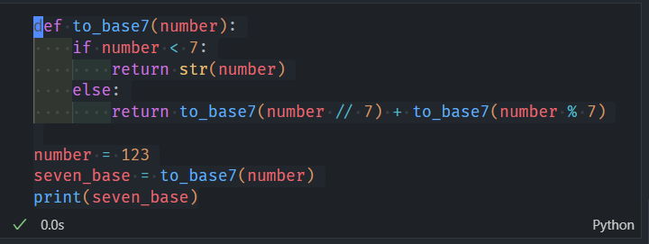

# 一、库函数
十进制转换为其他进制
- `bin`:二进制
- `oct`:八进制
- `hex`:十六进制
  
其他进制转换为十进制
- `int`:十进制

任意进制转换
```python
def to_base7(number):
    if number < 7:
        return str(number)
    else:
        return to_base7(number // 7) + to_base7(number % 7)

number = 123
seven_base = to_base7(number)
print(seven_base)
```
